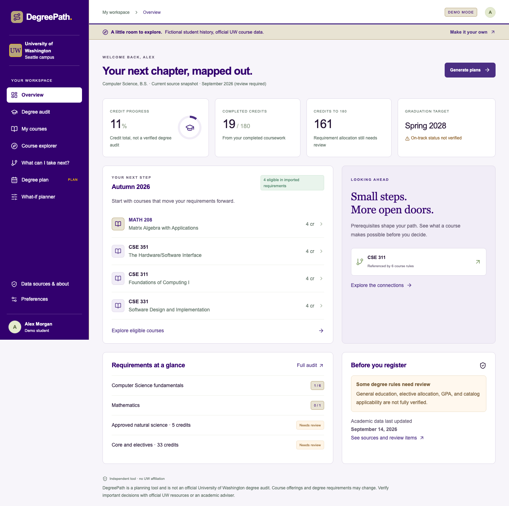
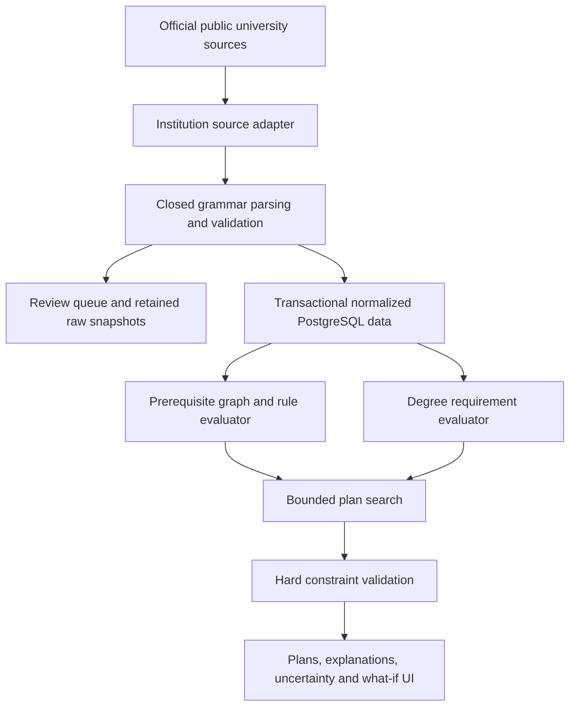

# DegreePath

An independent college course planner built with Next.js, TypeScript, PostgreSQL, Prisma, Auth.js, Zod, React and Tailwind. It evaluates structured prerequisites and searches for quarter-by-quarter course plans without an LLM or a paid API.

**Current status: functional full-stack MVP with partial UW Seattle Computer Science academic coverage. This is not a verified end-to-end graduation planner yet.** The application deliberately returns partial plans when degree rules, grades or academic data cannot be verified.

## What you can use

- Public demo with fictional student history and real, source-derived UW course information.
- Account creation, sign in/out, hashed passwords, protected application routes and user-scoped PostgreSQL persistence.
- Six-step onboarding, course history with optional grades and in-progress terms, and planning preferences.
- Overview, degree audit, course explorer, next-course recommendations, dependency trees, plan comparison and what-if editing.
- Three deterministic strategies: Fastest, Balanced and Light workload. Every result explains its choices and uncertainties.
- Saved plans, server-validated edited plans, and generated drafts that survive navigation. A draft is hidden when its input snapshot no longer matches the current student record.
- Official source citations, timestamps, review queues and import diagnostics.



## Academic support — read before relying on a plan

| Dimension                                  | Implemented coverage                                                                                                          |
| ------------------------------------------ | ----------------------------------------------------------------------------------------------------------------------------- |
| Institution / campus                       | University of Washington / Seattle                                                                                            |
| Calendar                                   | Quarter system: Winter, Spring, Summer, Autumn; optional summer                                                               |
| Program                                    | Computer Science, B.S.; **partial planning**                                                                                  |
| Catalog selection                          | `uw-seattle-current-2026-09`, labeled “Current source snapshot · September 2026 (review required)”                            |
| Verified historical catalog years          | **None**. A retrieval date is not proof of a student's governing catalog year.                                                |
| Course data                                | 172 undergraduate descriptions: 93 CSE and 79 MATH                                                                            |
| Prerequisite parser                        | 145 PARSED records; 27 NEEDS_REVIEW records, including one course with no description                                         |
| Confirmed offerings                        | 54 imported undergraduate CSE course presences in Autumn 2026                                                                 |
| CS rules normalized                        | Fundamental-course alternatives, minimum grades and standard/honors mathematics alternatives                                  |
| Degree-wide rules                          | 180-credit threshold represented; science, elective allocation, general education, language, GPA and residency require review |
| Computer Engineering / Data Science option | Not implemented or selectable                                                                                                 |
| Other institutions                         | No invented placeholder datasets                                                                                              |

The official 2023 checklist linked by the department lists MATH 208 as 3 credits; the current course catalog and CS catalog requirements reflect a 4-credit MATH 208. The app uses the current course catalog for course credits, preserves the conflict in source-health notes and does **not** assert that the current snapshot applies to earlier students.

The initial major-level requirements are based on the current CS catalog, not the older PDF. Minimum grades are enforced; an unknown grade is not assumed to be 2.0 or higher. Planned coursework never creates a fabricated future grade. Therefore grade-dependent degree completion can remain under review even when a useful course sequence is generated.

## Screenshots

The end-to-end suite writes portfolio demo and mobile screenshots under `docs/screenshots/`; failure screenshots and traces go under `test-results/`. Suggested captures: landing page, overview, prerequisite tree and what-if violations. These screenshots show fictional student records, never private user records.

## Local setup

Use Node.js 22.12+ or Node.js 24 (tested with 24.14.1), npm, and PostgreSQL. No OpenAI key is needed.

```sh
npm ci
cp .env.example .env
openssl rand -base64 32
```

Put the generated secret in `AUTH_SECRET`. The example database credentials are for local development only.

If you already have PostgreSQL, create a database and set `DATABASE_URL`. Otherwise the development-only embedded PostgreSQL package starts a real isolated server, bound to `127.0.0.1:54329`, and stores its files under ignored `.local-db/`:

```sh
npm run db:local
```

Leave that terminal running. In another terminal:

```sh
npm run db:generate
npm run db:migrate
npm run data:seed
npm run dev
```

Open [DegreePath locally](http://127.0.0.1:3000) or the [public demo](http://127.0.0.1:3000/demo). Create an account for personal planning. No default accounts or passwords are seeded.

`data:seed` imports saved official HTML-derived data and its original timestamps. It does not fabricate university rules or refresh the internet. The demo runs without PostgreSQL; private account routes require a configured, migrated database. Demo edits live only in sessionStorage for the current browser session.

## Environment variables

| Variable          | Purpose                                                                                       |
| ----------------- | --------------------------------------------------------------------------------------------- |
| `DATABASE_URL`    | PostgreSQL connection string for Prisma; use TLS and appropriate pooling for hosted databases |
| `AUTH_SECRET`     | Strong private session-signing secret; generate independently for each environment            |
| `AUTH_URL`        | Canonical application origin; local default `http://127.0.0.1:3000`                           |
| `AUTH_TRUST_HOST` | Set `true` only behind a trusted deployment proxy such as Vercel                              |

`.env` is ignored. Never deploy the example development credentials. Auth.js handles encrypted JWT session cookies; the application does not need database session or OAuth account tables for the configured credentials provider.

## Official data pipeline



Current sources:

- [UW CSE Course Catalog](https://www.washington.edu/students/crscat/cse.html)
- [UW Mathematics Course Catalog](https://www.washington.edu/students/crscat/math.html)
- [Public Autumn 2026 CSE Course Offerings](https://www.washington.edu/students/timeschd/pub/AUT2026/cse.html)
- [UW Computer Science program catalog](https://www.washington.edu/students/gencat/program/S/ComputerScience-210.html)
- [Allen School degree requirements](https://www.cs.washington.edu/academics/undergraduate/degree-requirements/) — traceability and conflict review
- [Allen School course lists](https://www.cs.washington.edu/academics/undergraduate/degree-requirements/courses/) — preserved raw; full elective/science normalization pending

### Intentional live refresh

```sh
npm run data:import:uw
npm run data:status
```

The current CLI refreshes CSE, MATH, the CS program and **Autumn 2026 CSE offerings**. The adapter exposes `fetchCourseOfferings(term)` for additional quarters; the CLI's explicit term scope must be expanded and tested before refreshing other terms. The app never crawls on startup.

The fetcher allows only approved UW hosts and public offering paths, checks robots.txt, uses a clear User-Agent, waits at least 1.5 seconds between requests, times out after 20 seconds and retries 429/5xx responses at most three times. Redirects and authentication responses fail closed. Network exceptions fail the run. It never requests NetID-only Time Schedule or enrollment links.

A successful transaction upserts courses and rules, replaces only fetched offering scopes, imports program trees and records source snapshots. Malformed pages, changed reviewed requirement text, duplicate courses and invalid records reject the batch. Previously valid data remains intact; failed fetch/parse evidence is preserved with review status. Import history is retained, including deliberately failed rollback tests when tests use the local database.

For fixture maintenance only:

```sh
npm run data:capture:uw
npm run data:normalize
npm run data:seed
```

Review fixture and normalized JSON diffs before accepting them. Tests use local fixtures, never live UW requests. Updating the production database does not silently rewrite the shipped public demo snapshot.

## Domain models and correctness

### Prerequisites

`Rule` is a discriminated expression tree: TRUE, COURSE_COMPLETED, AND, OR, MIN_GRADE, CONCURRENT_ALLOWED, MIN_CREDITS, PROGRAM_STATUS, PERMISSION_REQUIRED and RAW_UNSUPPORTED.

Evaluation returns SATISFIED, MISSING or UNKNOWN with deterministic reasons. AND/OR grouping stays intact; unsupported text remains unknown; a satisfied OR branch can satisfy the expression even if a different alternative is unsupported. Recommended preparation is a separate field.

UW parsing accepts only a small, completely consumed grammar. It does not attempt broad natural-language interpretation. AP scores, equivalency phrases, placement conditions and other unrecognized syntax are retained for review. Absence of a description cannot imply absence of prerequisites.

Course graphs support direct dependents, transitive closure, cycle detection and shortest edge paths. A separate prerequisite-set search preserves OR alternatives across AND unions, so shared prerequisites count once. Its 128-option cap marks a truncated result for review. Graph edges show references, not a promise that completing one course alone unlocks registration.

### Requirements

Hierarchical rules support ALL_OF, ANY_OF, CHOOSE_N, course lists, credit thresholds, subject/level and attribute filters, total/upper-division credits and manual review. Audits distinguish complete, partial, remaining and review states. The UI evaluates completed, in-progress and planned records separately.

ALL_OF allocation prevents implicit double counting. Explicitly shared groups and whole-degree credit totals can reuse evidence. Ambiguous overlapping choice allocations remain REVIEW. Allocation and program alternatives use bounded/conservative heuristics; they do not guarantee globally optimal elective allocation.

Transfer/AP credit equivalence, repeated courses, waivers, double majors, residency, language placement and cumulative GPA policies are **not inferred**. Those degree rules remain manual review.

### Planner

The institution-independent search takes normalized data, a program, a record and preferences. It selects candidates from remaining requirements and unsatisfied prerequisite branches. It excludes completed/in-progress duplicates, unresolved prerequisites, variable-credit courses, unavailable courses, known credit restrictions and absent courses in a complete offering scope. Explicitly permitted concurrent courses must appear together in the final candidate batch.

Default bounds: 14 shortlisted candidates per state, at most 6 courses per batch, 320 enumerated batches before pruning, 48 retained batches, beam width 12 and horizon 16 terms. Stable ordering and tie breaking make identical inputs deterministic. The algorithm is a heuristic, not a proof of global optimality or infeasibility.

`validatePlan` is independent of scoring. It checks duplicate courses, order, prerequisites, concurrent obligations, credit range, optional-term settings, unavailable courses, variable credits, credit overlaps and offering scope. Edited plans are revalidated on the server; invalid hard constraints must be repaired before saving. Valid edits preserve the exact term assignments and receive no optimizer score.

A full result requires satisfied requirements **and** VERIFIED program status. Partial results never receive a graduation date. Unknown future availability is explicitly warned about. In-progress courses become conditional completion evidence only after their recorded term; missing grade evidence remains unknown.

### Scoring

Weights live in `SCORING` in `src/domain/planner.ts`:

| Dimension                                     |                               Default |
| --------------------------------------------- | ------------------------------------: |
| Fractional progress across requirement leaves |                         +100 per unit |
| Relevant direct prerequisite connections      |                               +4 each |
| Confirmed offering                            |                         +3 per course |
| Unconfirmed offering                          |                         −2 per course |
| Deviation from target credit load             |                −2 per credit per term |
| Each elapsed term                             | −18 fastest / −10 balanced / −4 light |

Preference utility accumulates across quarters. Fastest targets the maximum; Balanced targets the midpoint; Light targets the minimum and prefers batches within that target when available. These labels describe strategies, not proven optimums. Grade review may limit measured progress. Credits are a workload proxy; no course-difficulty estimates or offering-rarity statistics are invented.

### Offering confidence

CONFIRMED means present in a dated official Course Offerings snapshot. It does not guarantee seats, major access or future registration. NOT_LISTED is derived only within a successfully imported complete subject/term scope. HISTORICAL_PATTERN is modeled, but no historical offering dataset is populated. UNKNOWN covers terms without reliable imported evidence. Published offering-pattern text is shown verbatim and never promoted to confirmation.

## Database and security

Prisma models institutions, campuses, calendars, academic terms, catalog versions, departments, courses and attributes, prerequisite rules, offerings, optional sections, programs/catalogs, hierarchical requirement groups and course mappings, users, profiles, student courses, saved plan terms/courses, import runs, snapshots and auth-attempt counters.

Two migrations are included: the initial normalized schema and the profile's persisted draft-plan JSON field. Catalogs and academic rules are separate from student state. Stable identifiers must be unique across adapters; new adapters should namespace course IDs by institution/campus. The generic engine treats IDs as opaque and contains no UW imports.

Passwords use salted Node scrypt and timing-safe comparison. Auth.js owns session handling. Private routes and API handlers require a session user ID. All record/plan queries include that server-derived user ID. Zod validates mutations and rejects unexpected identity fields; mutation routes validate Origin. Persistent database counters limit repeated sign-in and signup attempts for each normalized email identity. No client-supplied user ID selects an owner.

Before operating a public service, add account recovery/email verification and deployment-level abuse controls. These are not implemented. Do not expose the local development database or its credentials.

## Tests and production build

Start local PostgreSQL, migrate and seed before the integration/E2E suites. Playwright is configured to use installed Google Chrome; on CI install Chrome with `npx playwright install chrome` or configure the bundled Chromium channel.

```sh
npm run typecheck
npm run lint
npm test
npm run build
npm run test:e2e
npx prisma validate
npm audit
```

The E2E config starts the production server when port 3000 is free. Stop an old server before testing a new build. Reports and traces are ignored under `playwright-report/` and `test-results/`.

Tests cover prerequisite Boolean logic, grade/permission uncertainty, concurrency, recommendations, graph algorithms, requirement allocation, eligibility, term calendars, constraints, deterministic plans, impossible targets, preferences, what-if changes, official HTML parsing and changed-source rejection. Database tests cover hashes, user isolation and transaction rollback. E2E covers demo, signup/onboarding, course entry, planning, audit, graph inspection, what-if, save, sign out/in, persistence, cross-user access and mobile overflow.

A 60-course synthetic benchmark is included with a four-second budget; synthetic academic data is confined to tests. See `IMPLEMENTATION_REPORT.md` for the final run results.

## Updating an existing Vercel deployment

Before the first production update, confirm that the existing Vercel project has `DATABASE_URL`, `AUTH_SECRET`, `AUTH_URL` set to the final HTTPS domain, and `AUTH_TRUST_HOST=true`. Use a TLS PostgreSQL connection string supported by the database provider; the embedded local PostgreSQL server must never run on Vercel.

For each release, run the checks below locally, push the reviewed changes to the connected Git repository, then use Vercel's deployment preview before promoting it. Apply `npm run db:migrate` only when a new committed migration is present, and run it once against the intended database as a controlled release step. This polish pass adds no migration. The UW importer is an explicit operational task, not an application-startup action; review the Source Status page and unsupported rules after any production import.

```sh
npm ci
npm run typecheck
npm run lint
npm test
npm run build
```

After deployment, smoke-test sign in, saved-plan isolation, and the public demo on the production domain. Keep `AUTH_URL` aligned with that canonical domain.

Scheduled refresh can later call the same importer from a protected job runner with appropriate database credentials, rate limits and alerting. No scheduler or publicly callable import endpoint is enabled by default.

## Limitations and next milestones

1. Verify a specific governing UW catalog year and fully normalize its degree rules, elective lists, science alternatives, general education, residency and repeat/grade policy. Until then, do not advertise complete graduation planning.
2. Import approved science/general-education departments and additional public offering terms; expand per-term enrollment restrictions. Only CSE and MATH are currently available for course entry.
3. Validate and add Computer Engineering separately, including engineering science totals, systems electives and capstones.
4. Expand prerequisite grammar only with reviewed fixtures and regression tests. Add structured AP/transfer evidence and adviser-approved exception workflows.
5. Improve globally consistent elective allocation, alternative-branch search and large-program search coverage. Current bounds can miss valid schedules.
6. Add section scheduling only after verifying public meeting-time semantics, linked lecture/lab requirements and conflict rules. Meeting-time optimization is not implemented.
7. Split the sizeable workspace presentation component into smaller view components as UI development grows. Domain logic is already separate.
8. Add email verification, password recovery, broader abuse controls and production monitoring before opening public signup at scale.

## Disclaimer

DegreePath is a planning tool and is not an official University of Washington degree audit. Course offerings and degree requirements may change. Verify important decisions with official UW resources or an academic adviser. DegreePath is not affiliated with UW.
